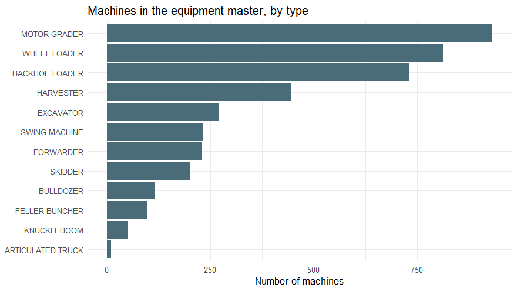
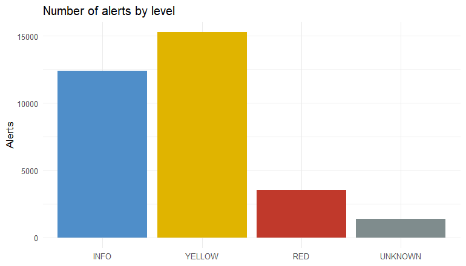

# 1. Data Understanding and Preparation

> **Note:** this notebook runs on the **synthetic** dataset generated by
> `scripts/00_generate_synthetic_data.R`. The original project used real
> telemetry data from a heavy-equipment dealer that cannot be shared; the
> synthetic data keeps the same structure and data-quality issues.

## Initial data collection

Two sources describe the state of the machines in the hands of customers:

* **Telemetry alerts** (`telemetry_alerts.csv`): history of the alerts emitted
  by each machine (fault code, machine ID, severity level, product line...).
* **Equipment master** (`equipment_master.csv`): descriptive data per machine
  (sales date, machine type, last service date...).

To narrow the scope, the analysis covers **machines sold between 2011 and 2020
with alerts generated during 2020**.

## Libraries


``` r
library(tidyverse)
library(janitor)
library(skimr)
library(lubridate)
```

## Data description

The telemetry alert table contains the following columns:

| Column | Description | Type |
|---|---|---|
| `decal_model_nm` | Machine model | Categorical |
| `alert_level` | Alert severity level | Categorical |
| `tla_spn_fmi` | Fault code ID | Categorical |
| `alert_defn_dsc` | Fault code description | Categorical |
| `dealer_name` / `dealer_acct_id` | Dealer name and ID | Categorical |
| `pin_prefix` | Origin ID of the machine | Categorical |
| `prod_line_nm` | Product line name | Categorical |
| `tier_level` | Emission standard | Categorical |
| `tla` | Three-letter abbreviation: component group where the fault originates | Categorical |
| `first_cptr_tm` | Date the fault code was activated | Date |
| `mfg_dt` | Date the machine was activated in telemetry | Date |
| `native_pin` / `pin` | Machine ID (full / abbreviated) | Categorical |
| `start_of_month` | Month of the fault | Date |
| `first_dtc_engn_hours` | Engine hours at the time of the fault | Numeric |
| `last_known_engn_hours` | Engine hours at data extraction | Numeric |
| `last_known_lat` / `last_known_long` | Last known position | Numeric |
| `sum_ocr_cnt` | Number of occurrences of the fault | Numeric |

Some variables look important at first glance (`decal_model_nm`,
`alert_level`, `first_dtc_engn_hours`, `alert_defn_dsc`, `prod_line_nm`,
`sum_ocr_cnt`) but we need to verify that they really are.

## Loading the data


``` r
base <- read_csv("data/synthetic/telemetry_alerts.csv") %>%
  clean_names()

base_desc <- read_csv("data/synthetic/equipment_master.csv") %>%
  clean_names()
```

The telemetry table has **32,594 rows and
20 columns**; the equipment master has
**4,131 machines**.


``` r
glimpse(base)
```

```
## Rows: 32,594
## Columns: 20
## $ decal_model_nm        <chr> "WL250G", "WL650", "MG520G", "KB650", "BL210K", "MG210", "BL310K", "MG330K", "~
## $ alert_level           <chr> "YELLOW", "RED", "INFO", "INFO", "UNKNOWN", "YELLOW", "YELLOW", "INFO", "INFO"~
## $ tla_spn_fmi           <chr> "BRK-124.18", "HYD-3502.9", "SCR-9079.19", "WAB-5765.24", "Invalid-DTC-Name", ~
## $ alert_defn_dsc        <chr> "YELLOW   BRK 000124.18    Component not responding", "RED   HYD 003502.09    ~
## $ dealer_name           <chr> "SALINAS Y FABRES S.A.", "SALINAS Y FABRES S.A.", "SALINAS Y FABRES S.A.", "SA~
## $ pin_prefix            <chr> "1DX", "1DX", "1DX", "HCM", "1AX", "1DX", "1AX", "1DX", "1AX", "1FX", "1DX", "~
## $ prod_line_nm          <chr> "WHEEL LOADERS", "WHEEL LOADERS", "MOTOR GRADERS", "KNUCKLEBOOM LOADERS", "BAC~
## $ tier_level            <chr> "Tier 3", "Non-Certified", "Tier 3", NA, "Non-Certified", "Non-Certified", "No~
## $ tla                   <chr> "BRK", "HYD", "SCR", "WAB", NA, "ENG", "YAW", "CAN", "EHC", "TUR", "VSS", "ALS~
## $ dealer_acct_id        <dbl> 100001, 100001, 100001, 100001, 100001, 100001, 100001, 100001, 100001, 100001~
## $ first_cptr_tm         <dttm> 2020-07-27 18:15:29, 2020-05-17 21:45:37, 2020-04-19 22:54:38, 2020-05-03 08:~
## $ mfg_dt                <dttm> 2020-10-29, 2019-08-15, 2016-03-15, 2019-05-15, 2018-10-19, 2018-09-05, 2020-~
## $ native_pin            <chr> "1DX851VHZSM078233", "1DX433MXNCM778829", "1DX573QVYCB396533", "HCM827ZURNF162~
## $ pin                   <chr> "DX851VH078233", "DX433MX778829", "DX573QV396533", "CM827ZU162835", "AX011LY35~
## $ start_of_month        <date> 2020-07-01, 2020-05-01, 2020-04-01, 2020-05-01, 2020-03-01, 2020-07-01, 2020-~
## $ first_dtc_engn_hours  <dbl> 645.78, 3074.91, 10025.55, 2648.68, 3126.25, 2199.48, 409.80, 7143.74, 9201.75~
## $ last_known_engn_hours <dbl> 751.53, 3620.97, 10480.64, 3101.15, 3360.67, 2480.74, 804.86, 7375.67, 9610.47~
## $ last_known_lat        <dbl> -38.6556, -44.1573, -29.3151, -37.6892, -37.5826, -44.8140, -41.6142, -24.4428~
## $ last_known_long       <dbl> -69.1110, -70.2349, -68.1404, -69.2722, -73.4100, -71.9205, -73.9537, -71.0746~
## $ sum_ocr_cnt           <dbl> 1, 29, 7, 856, 8, 3, 3, 1, 5, 167, 2, 6, 23, 5, 18, 3, 1, 18, 6, 13, 44, 1, 1,~
```

### Machine types

The machines are mostly **construction** and **forestry** equipment.
The variable `prod_line_nm` gives the product line, and
`machine_type_l2` the family it belongs to.


``` r
base_desc %>%
  count(machine_type_l3) %>%
  ggplot(aes(x = reorder(machine_type_l3, n), y = n)) +
  geom_col(fill = "#4a6b78") +
  coord_flip() +
  theme_minimal() +
  labs(title = "Machines in the equipment master, by type",
       x = NULL, y = "Number of machines")
```



### Alert levels

We will focus on the variable `alert_level`, which describes the health of
the machine. Customers who receive an alert know they must inspect or
service the machine. A model able to **predict which machines are prone to
more severe failures** would allow the after-sales team to contact those
customers *before* the failure happens.

* `UNKNOWN`: unknown alerts (sensor triggered by mistake, etc.).
* `INFO`: least urgent. The machine is eligible for preventive service.
* `YELLOW`: high urgency. The machine can keep working but needs service soon.
* `RED`: most urgent. The machine needs immediate attention.


``` r
base %>%
  count(alert_level) %>%
  mutate(alert_level = factor(alert_level, levels = c("INFO", "YELLOW", "RED", "UNKNOWN"))) %>%
  ggplot(aes(x = alert_level, y = n, fill = alert_level)) +
  geom_col(show.legend = FALSE) +
  scale_fill_manual(values = c(INFO = "#4f8ec9", YELLOW = "#e0b400",
                               RED = "#c0392b", UNKNOWN = "#7f8c8d")) +
  theme_minimal() +
  labs(title = "Number of alerts by level", x = NULL, y = "Alerts")
```



## Integration of both sources

Both tables are joined by machine ID (`native_pin` = `vin`) to obtain the
sales date, machine type and last service date of each machine.


``` r
base_join <- left_join(base, base_desc, by = c("native_pin" = "vin"))

dim(base_join)
```

```
## [1] 32594    29
```

### Observations before cleaning

1. Dates are stored as `POSIXct`; they need to be converted.
2. Some variables add no value for predicting failures:
   * `dealer_name` / `dealer_acct_id`: single dealer, no variability.
   * `tier_level`: emission standard.
   * `start_of_month`: already contained in the more precise `first_cptr_tm`.
   * `last_known_lat` / `last_known_long`: position reported by the machine.
   * `pin`: same information as `native_pin`.
   * `last_known_engn_hours`: hours at extraction time, not at failure time.

We also create two new variables:

* `year_sold`: year of the sales invoice.
* `prior_service`: `Yes` if the last service was carried out in 2019 or 2020
  (i.e. the machine is still in contact with the dealer's service network).


``` r
base_join2 <- base_join %>%
  mutate(
    mfg_dt        = as_date(mfg_dt),
    first_cptr_tm = as_date(first_cptr_tm),
    year_sold     = as.character(format(invoice_date, "%Y")),
    service_year  = as.character(format(last_service_date, "%Y")),
    prior_service = factor(case_when(service_year %in% c("2019", "2020") ~ "Yes",
                                     TRUE ~ "No"))
  ) %>%
  select(-dealer_acct_id, -pin, -tier_level, -dealer_name, -start_of_month,
         -last_known_lat, -last_known_long, -last_known_engn_hours,
         -tla_spn_fmi, -service_year, -last_service_date, -invoice_date,
         -brand, -model, -machine_type_l3, -hour_meter, -odometer, -n)
```

After removing the variables above we have **14 columns**.


``` r
skim(base_join2)
```


Table: Data summary

|                         |           |
|:------------------------|:----------|
|Name                     |base_join2 |
|Number of rows           |32594      |
|Number of columns        |14         |
|_______________________  |           |
|Column type frequency:   |           |
|character                |9          |
|Date                     |2          |
|factor                   |1          |
|numeric                  |2          |
|________________________ |           |
|Group variables          |None       |


**Variable type: character**

|skim_variable   | n_missing| complete_rate| min| max| empty| n_unique| whitespace|
|:---------------|---------:|-------------:|---:|---:|-----:|--------:|----------:|
|decal_model_nm  |         0|          1.00|   5|   6|     0|      328|          0|
|alert_level     |         0|          1.00|   3|   7|     0|        4|          0|
|alert_defn_dsc  |         0|          1.00|   4|  66|     0|     2797|          0|
|pin_prefix      |         0|          1.00|   3|   3|     0|        7|          0|
|prod_line_nm    |         0|          1.00|   3|  23|     0|       13|          0|
|tla             |       245|          0.99|   3|   3|     0|       56|          0|
|native_pin      |         0|          1.00|  17|  17|     0|     1391|          0|
|machine_type_l2 |      2164|          0.93|   8|  12|     0|        2|          0|
|year_sold       |      2164|          0.93|   4|   4|     0|       11|          0|


**Variable type: Date**

|skim_variable | n_missing| complete_rate|min        |max        |median     | n_unique|
|:-------------|---------:|-------------:|:----------|:----------|:----------|--------:|
|first_cptr_tm |         0|          1.00|2020-01-01 |2020-12-31 |2020-06-30 |      366|
|mfg_dt        |       234|          0.99|2011-02-19 |2020-10-29 |2018-02-15 |     3343|


**Variable type: factor**

|skim_variable | n_missing| complete_rate|ordered | n_unique|top_counts           |
|:-------------|---------:|-------------:|:-------|--------:|:--------------------|
|prior_service |         0|             1|FALSE   |        2|No: 25130, Yes: 7464 |


**Variable type: numeric**

|skim_variable        | n_missing| complete_rate|    mean|      sd| p0|     p25|     p50|     p75|     p100|hist  |
|:--------------------|---------:|-------------:|-------:|-------:|--:|-------:|-------:|-------:|--------:|:-----|
|first_dtc_engn_hours |         0|          1.00| 5667.59| 5033.43|  0| 2004.07| 4548.82| 8426.67| 100548.4|▇▁▁▁▁ |
|sum_ocr_cnt          |       558|          0.98|   24.97|  170.40|  1|    1.00|    3.00|   12.00|  10835.0|▇▁▁▁▁ |

## Save intermediate result


``` r
dir.create("data/processed", recursive = TRUE, showWarnings = FALSE)
saveRDS(base_join2, "data/processed/base_join2.rds")
```

