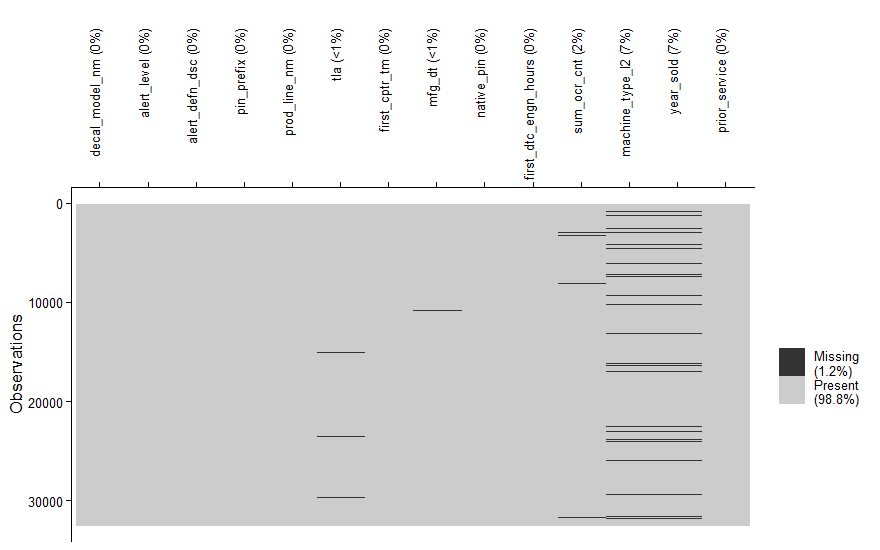

# 2. Data Quality and Cleaning

Input: `data/processed/base_join2.rds` (output of notebook 01, built on the
synthetic dataset).


``` r
library(tidyverse)
library(skimr)
library(naniar)

base_join2 <- readRDS("data/processed/base_join2.rds")
n_initial <- nrow(base_join2)
```

## Summary statistics

First, a preliminary review of summary statistics, missing values and
histograms by variable type.


``` r
skim(base_join2)
```


Table: Data summary

|                         |           |
|:------------------------|:----------|
|Name                     |base_join2 |
|Number of rows           |32594      |
|Number of columns        |14         |
|_______________________  |           |
|Column type frequency:   |           |
|character                |9          |
|Date                     |2          |
|factor                   |1          |
|numeric                  |2          |
|________________________ |           |
|Group variables          |None       |


**Variable type: character**

|skim_variable   | n_missing| complete_rate| min| max| empty| n_unique| whitespace|
|:---------------|---------:|-------------:|---:|---:|-----:|--------:|----------:|
|decal_model_nm  |         0|          1.00|   5|   6|     0|      328|          0|
|alert_level     |         0|          1.00|   3|   7|     0|        4|          0|
|alert_defn_dsc  |         0|          1.00|   4|  66|     0|     2797|          0|
|pin_prefix      |         0|          1.00|   3|   3|     0|        7|          0|
|prod_line_nm    |         0|          1.00|   3|  23|     0|       13|          0|
|tla             |       245|          0.99|   3|   3|     0|       56|          0|
|native_pin      |         0|          1.00|  17|  17|     0|     1391|          0|
|machine_type_l2 |      2164|          0.93|   8|  12|     0|        2|          0|
|year_sold       |      2164|          0.93|   4|   4|     0|       11|          0|


**Variable type: Date**

|skim_variable | n_missing| complete_rate|min        |max        |median     | n_unique|
|:-------------|---------:|-------------:|:----------|:----------|:----------|--------:|
|first_cptr_tm |         0|          1.00|2020-01-01 |2020-12-31 |2020-06-30 |      366|
|mfg_dt        |       234|          0.99|2011-02-19 |2020-10-29 |2018-02-15 |     3343|


**Variable type: factor**

|skim_variable | n_missing| complete_rate|ordered | n_unique|top_counts           |
|:-------------|---------:|-------------:|:-------|--------:|:--------------------|
|prior_service |         0|             1|FALSE   |        2|No: 25130, Yes: 7464 |


**Variable type: numeric**

|skim_variable        | n_missing| complete_rate|    mean|      sd| p0|     p25|     p50|     p75|     p100|hist  |
|:--------------------|---------:|-------------:|-------:|-------:|--:|-------:|-------:|-------:|--------:|:-----|
|first_dtc_engn_hours |         0|          1.00| 5667.59| 5033.43|  0| 2004.07| 4548.82| 8426.67| 100548.4|▇▁▁▁▁ |
|sum_ocr_cnt          |       558|          0.98|   24.97|  170.40|  1|    1.00|    3.00|   12.00|  10835.0|▇▁▁▁▁ |

## Business-rule check: machines sold in 2021

The extraction was defined to contain alerts from **2020**, so it is
unusual that machines *sold in 2021* appear with alerts in 2020.


``` r
base_join2 %>%
  filter(year_sold == "2021") %>%
  summarise(n = n())
```

```
## # A tibble: 1 x 1
##       n
##   <int>
## 1   122
```

* **Affected records:** 122
* **Decision:** remove them; they are not significant (0.4% of the data) and violate the extraction rule.


``` r
base_join2 <- base_join2 %>%
  filter(is.na(year_sold) | year_sold != "2021")
```

## Missing values

The table below shows the number (`n_miss`) and percentage (`pct_miss`) of
missing values per variable, relative to the **32,472
records** that remain.


``` r
miss_var_summary(base_join2) %>%
  filter(n_miss != 0)
```

```
## # A tibble: 5 x 3
##   variable        n_miss pct_miss
##   <chr>            <int>    <num>
## 1 machine_type_l2   2164    6.66 
## 2 year_sold         2164    6.66 
## 3 sum_ocr_cnt        558    1.72 
## 4 tla                245    0.754
## 5 mfg_dt             231    0.711
```

``` r
vis_miss(base_join2) +
  theme_classic() +
  theme(axis.text.x = element_text(angle = 90, vjust = 0.5, hjust = 1))
```




The variables coming from the *equipment master* (`machine_type_l2`,
`year_sold`) are missing in **6.66%** of the
records: machines that raised alerts but are not in the equipment master. After consulting the telemetry team, the explanation is
that they are machines purchased before 2011 that have already exceeded their
useful life and are **not candidates for after-sales service**. We therefore
decide to discard them.

## Bias analysis

We now check the missing values of `sum_ocr_cnt` (number of fault
occurrences) and `tla` (fault category) to see whether dropping them would
bias the analysis.

**Definition of bias:** differences in the percentage of missing values
**greater than 5 percentage points** between the categories of `year_sold`,
which is a relevant variable for detecting failures.

**Missing `sum_ocr_cnt` by `year_sold`:**


``` r
miss_ocr <- base_join2 %>%
  group_by(year_sold) %>%
  summarise(n_miss = sum(is.na(sum_ocr_cnt)), n = n(),
            pct = n_miss / n * 100)
miss_ocr
```

```
## # A tibble: 11 x 4
##    year_sold n_miss     n   pct
##    <chr>      <int> <int> <dbl>
##  1 2011          18   587 3.07 
##  2 2012          16  1050 1.52 
##  3 2013          19   569 3.34 
##  4 2014           3   692 0.434
##  5 2015         134  3178 4.22 
##  6 2016          33  1983 1.66 
##  7 2017          81  5830 1.39 
##  8 2018          65  7094 0.916
##  9 2019          60  6338 0.947
## 10 2020          40  2987 1.34 
## 11 <NA>          89  2164 4.11
```

The gap between the year with the highest share of missing values
(**2015**
- 4.2%) and the lowest
(**2014**
- 0.4%) is below 5
points, so dropping these records **does not create bias**.

**Missing `tla` by `year_sold`:**


``` r
miss_tla <- base_join2 %>%
  group_by(year_sold) %>%
  summarise(n_miss = sum(is.na(tla)), n = n(),
            pct = n_miss / n * 100)
miss_tla
```

```
## # A tibble: 11 x 4
##    year_sold n_miss     n   pct
##    <chr>      <int> <int> <dbl>
##  1 2011          13   587 2.21 
##  2 2012          74  1050 7.05 
##  3 2013           9   569 1.58 
##  4 2014          10   692 1.45 
##  5 2015          33  3178 1.04 
##  6 2016           7  1983 0.353
##  7 2017          13  5830 0.223
##  8 2018          30  7094 0.423
##  9 2019          37  6338 0.584
## 10 2020           0  2987 0    
## 11 <NA>          19  2164 0.878
```

Year **2012** has 74
missing records (7.05%).
With our definition this looks like bias, so we inspect 2012 in more detail.


``` r
base_join2 %>%
  filter(year_sold == "2012", alert_level == "UNKNOWN") %>%
  group_by(alert_level, alert_defn_dsc) %>%
  summarise(n_miss = sum(is.na(tla)), n = n(), pct = n_miss / n * 100,
            .groups = "drop") %>%
  filter(pct != 0)
```

```
## # A tibble: 2 x 5
##   alert_level alert_defn_dsc   n_miss     n   pct
##   <chr>       <chr>             <int> <int> <dbl>
## 1 UNKNOWN     Invalid DTC Name     67    67   100
## 2 UNKNOWN     test                  7     7   100
```

The missing `tla` values of 2012 are all alerts of level `UNKNOWN`, grouped
under the description **`Invalid DTC Name`** (plus a handful of `test`
entries). They are not real faults, so they carry no information for
failure analysis. We can omit them without distorting the analysis.

## Cleaning

The missing `sum_ocr_cnt` values are within the 5-point tolerance, and the
2012 spike in `tla` is fully explained by non-informative `Invalid DTC Name`
records, so no relevant bias remains. All rows with missing values are
dropped.


``` r
base_limpia <- drop_na(base_join2)
```

The clean dataset (`base_limpia`) has **29,405
observations and 14 variables**
(3,189 rows removed,
9.8% of the initial data).


``` r
saveRDS(base_limpia, "data/processed/base_limpia_pre_outliers.rds")
```

