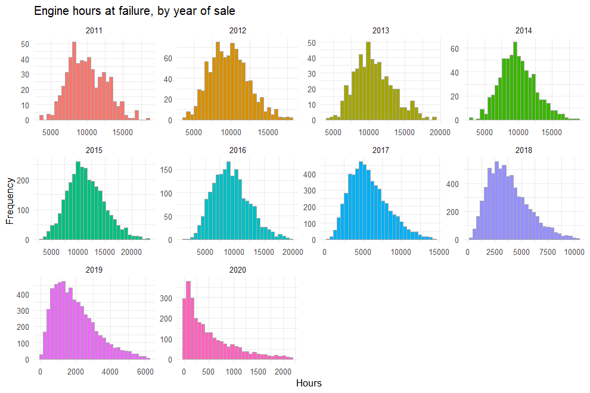
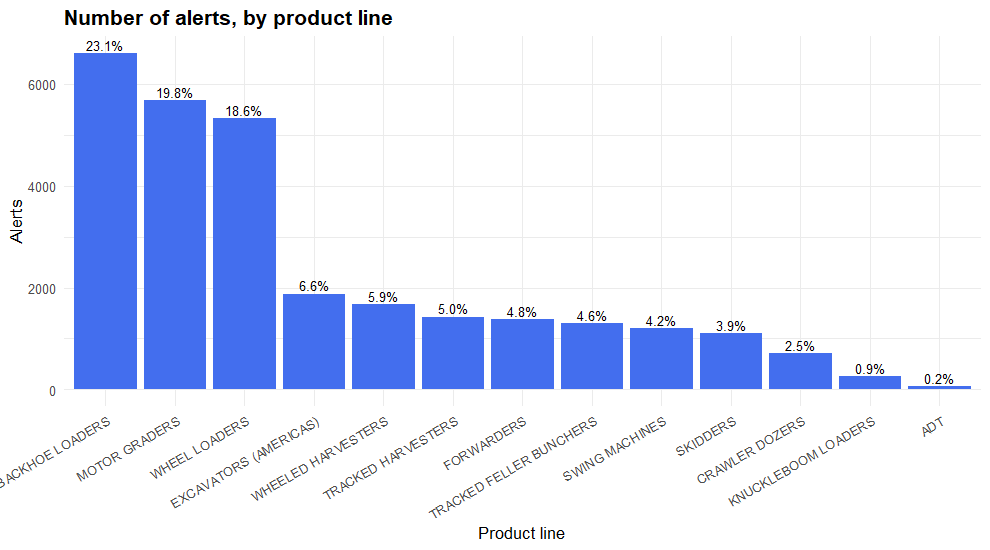
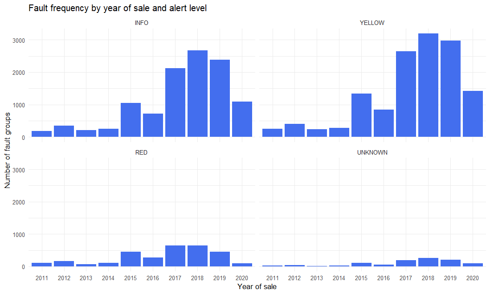

# 4. Descriptive Statistics

With a clean dataset (no missing values or outliers), we review descriptive
statistics by variable. Input: `data/processed/base_limpia.rds`
(output of notebook 03).


``` r
library(tidyverse)
library(skimr)

base_limpia <- readRDS("data/processed/base_limpia.rds")
```

The dataset has **28,616 observations**
and **14 variables**. The console output is long, but it
gives a clear picture of the values of each variable.


``` r
Hmisc::describe(base_limpia)
```

```
## base_limpia 
## 
##  14  Variables      28616  Observations
## --------------------------------------------------------------------------------------------------------------
## decal_model_nm 
##        n  missing distinct 
##    28616        0      325 
## 
## lowest : AD330L AD410G AD410L AD650L AD700L, highest: WL650L WL700  WL700G WL700K WL700L
## --------------------------------------------------------------------------------------------------------------
## alert_level 
##        n  missing distinct 
##    28616        0        4 
##                                           
## Value         INFO     RED UNKNOWN  YELLOW
## Frequency    11020    3024     994   13578
## Proportion   0.385   0.106   0.035   0.474
## --------------------------------------------------------------------------------------------------------------
## alert_defn_dsc 
##        n  missing distinct 
##    28616        0     2792 
## 
## lowest : INFO   ACL 000380.14    Sensor voltage below normal               INFO   ACL 001066.05    Fault active - monitor operation          INFO   ACL 002780.31    Circuit open or shorted                   INFO   ACL 003191.24    Restart engine and contact service        INFO   ACL 003693.01    Restart engine and contact service       
## highest: YELLOW   ZCM 007557.03    Component not responding                YELLOW   ZCM 007613.18    Circuit open or shorted                 YELLOW   ZCM 007741.06    Sensor voltage below normal             YELLOW   ZCM 008069.20    Data erratic, intermittent or incorrect YELLOW   ZCM 009825.16    Value out of range                     
## --------------------------------------------------------------------------------------------------------------
## pin_prefix 
##        n  missing distinct 
##    28616        0        7 
##                                                     
## Value        1AX   1BX   1CX   1DX   1EX   1FX   HCM
## Frequency   6600  1879   777 11002  4484  3610   264
## Proportion 0.231 0.066 0.027 0.384 0.157 0.126 0.009
## --------------------------------------------------------------------------------------------------------------
## prod_line_nm 
##        n  missing distinct 
##    28616        0       13 
## 
## lowest : ADT                     BACKHOE LOADERS         CRAWLER DOZERS          EXCAVATORS (AMERICAS)   FORWARDERS             
## highest: SWING MACHINES          TRACKED FELLER BUNCHERS TRACKED HARVESTERS      WHEEL LOADERS           WHEELED HARVESTERS     
## --------------------------------------------------------------------------------------------------------------
## tla 
##        n  missing distinct 
##    28616        0       56 
## 
## lowest : ACL ACR ADU ALC ALS, highest: WHL XHA XJC YAW ZCM
## --------------------------------------------------------------------------------------------------------------
## first_cptr_tm 
##          n    missing   distinct       Info       Mean    pMedian        Gmd        .05        .10        .25 
##      28616          0        366          1 2020-06-30      18444      122.3 2020-01-18 2020-02-05 2020-03-30 
##        .50        .75        .90        .95 
## 2020-06-29 2020-09-30 2020-11-25 2020-12-12 
## 
## lowest : 2020-01-01 2020-01-02 2020-01-03 2020-01-04 2020-01-05
## highest: 2020-12-27 2020-12-28 2020-12-29 2020-12-30 2020-12-31
## --------------------------------------------------------------------------------------------------------------
## mfg_dt 
##          n    missing   distinct       Info       Mean    pMedian        Gmd        .05        .10        .25 
##      28616          0       3198          1 2017-10-21      17550      826.3 2013-01-13 2015-02-20 2016-11-28 
##        .50        .75        .90        .95 
## 2018-04-03 2019-03-09 2020-01-17 2020-07-24 
## 
## lowest : 2011-02-19 2011-02-20 2011-02-22 2011-02-23 2011-02-24
## highest: 2020-10-25 2020-10-26 2020-10-27 2020-10-28 2020-10-29
## --------------------------------------------------------------------------------------------------------------
## native_pin 
##        n  missing distinct 
##    28616        0     1285 
## 
## lowest : 1AX002ZHKVJ799941 1AX006WVRSU177828 1AX007YRJCM445591 1AX009DORUA096528 1AX009UKEYF514956
## highest: HCM878MJWIM139366 HCM925FYHNE869656 HCM940BBCMT676326 HCM964QNMHX967304 HCM968SIIVD770739
## --------------------------------------------------------------------------------------------------------------
## first_dtc_engn_hours 
##        n  missing distinct     Info     Mean  pMedian      Gmd      .05      .10      .25      .50      .75 
##    28616        0    28259        1     5215     4874     4543    306.6    710.8   1891.4   4156.8   7893.1 
##      .90      .95 
##  11256.7  13180.2 
## 
## lowest : 5.04    5.16    5.19    5.26    5.32   , highest: 22549.1 22719.5 22836.3 22862.6 22955.1
## --------------------------------------------------------------------------------------------------------------
## sum_ocr_cnt 
##        n  missing distinct     Info     Mean  pMedian      Gmd      .05      .10      .25      .50      .75 
##    28616        0      553    0.955    24.98        6    42.03        1        1        1        3       12 
##      .90      .95 
##       41       85 
## 
## lowest :     1     2     3     4     5, highest:  7818  9432  9777 10300 10835
## --------------------------------------------------------------------------------------------------------------
## machine_type_l2 
##        n  missing distinct 
##    28616        0        2 
##                                     
## Value      CONSTRUCTION     FORESTRY
## Frequency         20258         8358
## Proportion        0.708        0.292
## --------------------------------------------------------------------------------------------------------------
## year_sold 
##        n  missing distinct 
##    28616        0       10 
##                                                                       
## Value       2011  2012  2013  2014  2015  2016  2017  2018  2019  2020
## Frequency    549   949   527   660  2953  1897  5603  6774  6007  2697
## Proportion 0.019 0.033 0.018 0.023 0.103 0.066 0.196 0.237 0.210 0.094
## --------------------------------------------------------------------------------------------------------------
## prior_service 
##        n  missing distinct 
##    28616        0        2 
##                       
## Value         No   Yes
## Frequency  21638  6978
## Proportion 0.756 0.244
## --------------------------------------------------------------------------------------------------------------
```

## `first_dtc_engn_hours`: engine hours at failure

Throughout the project we investigate which variables may help predict
failures. Here we analyse in detail the engine hours at the time of the
failure, starting with the skewness of the distribution.

* **Skewness coefficient:**


``` r
psych::skew(base_limpia$first_dtc_engn_hours)
```

```
## [1] 0.8945455
```

* **Kurtosis:**


``` r
psych::kurtosi(base_limpia$first_dtc_engn_hours)
```

```
## [1] 0.1989003
```

* **Quartiles:**


``` r
quantile(base_limpia$first_dtc_engn_hours, prob = seq(0, 1, 0.25))
```

```
##        0%       25%       50%       75%      100% 
##     5.040  1891.408  4156.845  7893.115 22955.100
```

Summary by year of sale:


``` r
hours_by_year <- base_limpia %>%
  group_by(year_sold) %>%
  summarise(
    Min = min(first_dtc_engn_hours),
    Q1 = quantile(first_dtc_engn_hours, probs = 0.25),
    Median = quantile(first_dtc_engn_hours, probs = 0.50),
    Q3 = quantile(first_dtc_engn_hours, probs = 0.75),
    Max = max(first_dtc_engn_hours),
    Mean = mean(first_dtc_engn_hours),
    `Std. Dev.` = sd(first_dtc_engn_hours),
    Skewness = psych::skew(first_dtc_engn_hours),
    Kurtosis = psych::kurtosi(first_dtc_engn_hours)
  )
hours_by_year %>% mutate(across(where(is.numeric), ~ round(.x, 1)))
```

```
## # A tibble: 10 x 10
##    year_sold    Min    Q1 Median     Q3    Max   Mean `Std. Dev.` Skewness Kurtosis
##    <chr>      <dbl> <dbl>  <dbl>  <dbl>  <dbl>  <dbl>       <dbl>    <dbl>    <dbl>
##  1 2011      3684.  8054   9736. 11950. 18413.  9979.       2574.      0.3     -0.3
##  2 2012      3744   7847.  9633. 11374  18016.  9726.       2589.      0.4      0  
##  3 2013      4194.  8688  10318. 12306. 19085. 10614.       2692.      0.5     -0.1
##  4 2014      2986.  8082.  9674. 11554. 18737.  9903.       2613.      0.4      0.1
##  5 2015      3147.  9032. 11098  13648. 22955. 11424.       3393.      0.4      0  
##  6 2016      1546.  7117.  9129. 11193. 19564.  9363        3034.      0.5      0  
##  7 2017       348.  3838.  5366.  7236. 14349.  5727.       2506.      0.6      0.1
##  8 2018       261.  2364.  3484.  4940  10273.  3789.       1883.      0.7      0.2
##  9 2019        21.4 1020.  1720.  2668.  6135.  1965.       1221.      0.9      0.4
## 10 2020         5    117.   338.   747.  2162.   500.        489.      1.3      1
```

``` r
ggplot(base_limpia, aes(x = first_dtc_engn_hours, fill = year_sold)) +
  geom_histogram(col = "darkgrey", show.legend = FALSE, bins = 30) +
  labs(title = "Engine hours at failure, by year of sale",
       x = "Hours", y = "Frequency") +
  facet_wrap(~year_sold, scales = "free") +
  theme_minimal()
```




The histograms and the table together give a clear reading of each year.
For example, for machines sold in **2019** the engine hours at failure range
from **21.4 to
6,135.3 hours**, with a right-skewed
distribution (skewness = 0.89) around a mean of
1,965.3 hours.

## `prod_line_nm`: product line

`prod_line_nm` categorises the types of machinery. It is important to see
which product lines concentrate the alerts.


``` r
count_prod <- base_limpia %>%
  group_by(prod_line_nm) %>%
  count() %>%
  mutate(prop = n / nrow(base_limpia))
count_prod
```

```
## # A tibble: 13 x 3
## # Groups:   prod_line_nm [13]
##    prod_line_nm                n    prop
##    <chr>                   <int>   <dbl>
##  1 ADT                        70 0.00245
##  2 BACKHOE LOADERS          6600 0.231  
##  3 CRAWLER DOZERS            707 0.0247 
##  4 EXCAVATORS (AMERICAS)    1879 0.0657 
##  5 FORWARDERS               1377 0.0481 
##  6 KNUCKLEBOOM LOADERS       264 0.00923
##  7 MOTOR GRADERS            5676 0.198  
##  8 SKIDDERS                 1102 0.0385 
##  9 SWING MACHINES           1201 0.0420 
## 10 TRACKED FELLER BUNCHERS  1307 0.0457 
## 11 TRACKED HARVESTERS       1431 0.0500 
## 12 WHEEL LOADERS            5326 0.186  
## 13 WHEELED HARVESTERS       1676 0.0586
```

``` r
count_prod %>%
  ggplot(aes(x = reorder(prod_line_nm, -n), y = n)) +
  geom_bar(stat = "identity", fill = "royalblue2") +
  labs(title = "Number of alerts, by product line",
       x = "Product line", y = "Alerts") +
  theme_minimal() +
  theme(axis.text.x = element_text(angle = 30, hjust = 1),
        plot.title = element_text(face = "bold", size = 14)) +
  geom_text(aes(label = scales::percent(prop, accuracy = 0.1)),
            vjust = -0.3, size = 3)
```




The most represented product lines are
**BACKHOE LOADERS** (23.1%),
**MOTOR GRADERS** (19.8%) and
**WHEEL LOADERS** (18.6%).
Each product line belongs to a machine family (construction or forestry),
stored in `machine_type_l2`.

## `machine_type_l2` vs `prior_service`

Do construction and forestry machines carry out their services at the
dealer's service network?


``` r
gmodels::CrossTable(base_limpia$machine_type_l2, base_limpia$prior_service,
                    prop.t = FALSE, prop.chisq = FALSE,
                    dnn = c("Machine family", "Prior service?"))
```

```
## 
##  
##    Cell Contents
## |-------------------------|
## |                       N |
## |           N / Row Total |
## |           N / Col Total |
## |-------------------------|
## 
##  
## Total Observations in Table:  28616 
## 
##  
##                | Prior service? 
## Machine family |        No |       Yes | Row Total | 
## ---------------|-----------|-----------|-----------|
##   CONSTRUCTION |     17339 |      2919 |     20258 | 
##                |     0.856 |     0.144 |     0.708 | 
##                |     0.801 |     0.418 |           | 
## ---------------|-----------|-----------|-----------|
##       FORESTRY |      4299 |      4059 |      8358 | 
##                |     0.514 |     0.486 |     0.292 | 
##                |     0.199 |     0.582 |           | 
## ---------------|-----------|-----------|-----------|
##   Column Total |     21638 |      6978 |     28616 | 
##                |     0.756 |     0.244 |           | 
## ---------------|-----------|-----------|-----------|
## 
## 
```


Overall, **75.6%** of the machines that
reported an alert during 2020 had **no prior service** at the dealer's
service network. Construction machines are the most represented family and
also the one with the lowest share of prior service
(**14.4%** vs
**48.6%** for forestry machines).

## `sum_ocr_cnt`: number of fault occurrences

`sum_ocr_cnt` is a **cumulative frequency per machine** (it adds up the
faults recorded for a machine ID), so summing it directly would distort the
real picture. Instead, we build a data frame that counts how many times a
fault is registered for each alert level.


``` r
frecuencia_fallas <- base_limpia %>%
  group_by(alert_level, tla, prod_line_nm, year_sold) %>%
  summarise(n = n(), .groups = "drop")
```

``` r
frecuencia_fallas %>%
  mutate(alert_level = factor(alert_level, levels = c("INFO", "YELLOW", "RED", "UNKNOWN"))) %>%
  ggplot(aes(x = year_sold, y = n)) +
  geom_col(fill = "royalblue2") +
  labs(title = "Fault frequency by year of sale and alert level",
       x = "Year of sale", y = "Number of fault groups") +
  facet_wrap(~alert_level) +
  theme_minimal()
```



Machines sold between **2017 and 2020** show a higher number of alerts.
Talking to the technical teams, this makes sense: newer machines carry more
sensors and technology that can issue informative or preventive notices
frequently. Most of the volume concentrates in **YELLOW** and **INFO**
alerts.

## Answers to the initial questions

* **Can commercial management be driven by the data?**
  Yes. A large group of machines does not get serviced at the dealer's
  network, which is an opportunity for the sales team to focus on
  **construction machinery**.
* **Can telemetry be used for after-sales management?**
  Yes. Telemetry provides the exact location of each machine, so
  commercial proposals can be assigned to the **nearest service centre**.

> Next step (not covered in this repository): a supervised classification
> model to predict the alert level (e.g. `RED`/`YELLOW` vs `INFO`), using the
> clean dataset produced here.


``` r
saveRDS(base_limpia, "data/processed/base_final.rds")
```

