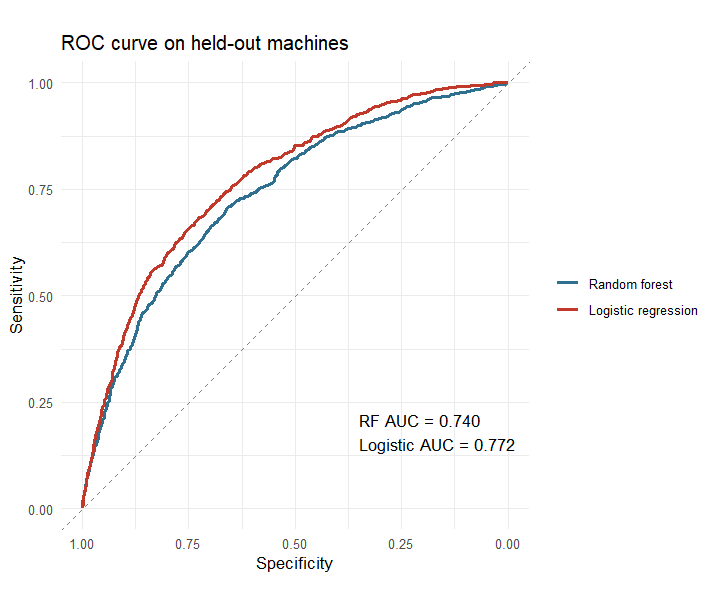
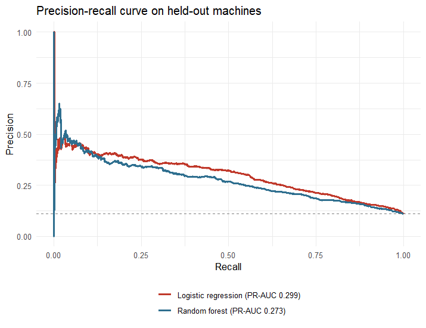
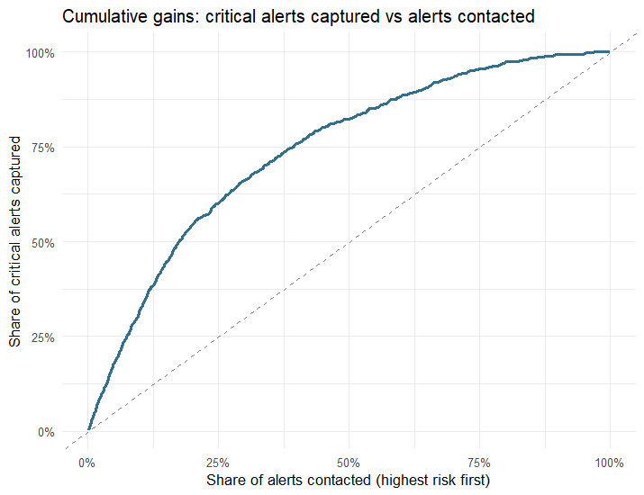
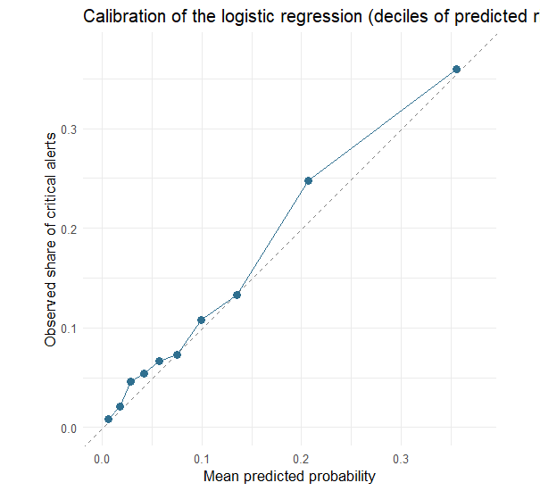
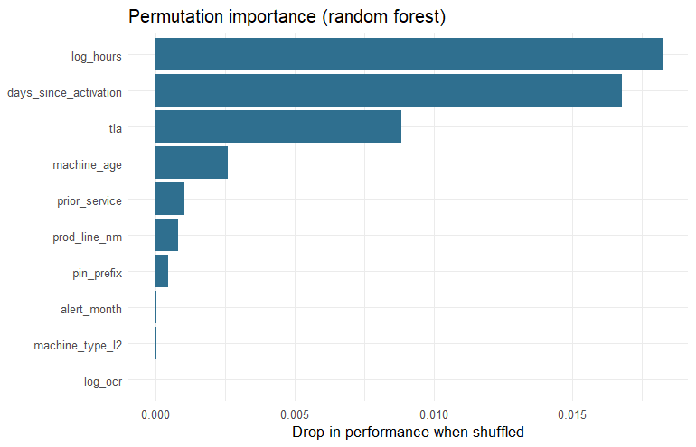

# 5. Predicting Critical Alerts with Machine Learning

> **Read this first - what these results do and do not mean.**
> The original telemetry data of this project is no longer available, so this
> notebook runs on the **synthetic dataset** built by
> `scripts/00_generate_synthetic_data.R`. In that generator the probability of
> a `RED` alert is *deliberately* tied to engine hours, product line, prior
> service and fault component group, plus random noise, through a **logistic
> relationship**. Therefore the metrics below show that the **methodology
> works and is leakage-free**; they are **not** performance estimates for real
> machines, and the fact that a logistic model is competitive here is a
> consequence of how the data was generated. With real data I would expect
> lower numbers and I would add time-based validation.

## Problem definition

**Business goal:** the after-sales team wants to be *proactive*: contact the
customers whose machines are more likely to raise a **critical (`RED`) alert**,
instead of waiting for the failure.

**Modelling task:** binary classification at alert level,
`critical` (`alert_level == "RED"`) vs `non_critical` (`INFO`, `YELLOW`,
`UNKNOWN`). The class is imbalanced (~1 in 9 alerts is critical), so accuracy
is a misleading metric; we use **ROC-AUC**, **precision-recall**, and a
business-oriented **top-decile capture rate**.

**Approach:** two models are compared with the same validation scheme: a
**logistic regression** baseline and a **random forest** (tuned). The final
model is selected with cross-validation on the training set only.

Input: `data/processed/base_final.rds` (clean table from notebook 04).


``` r
library(tidyverse)
library(rsample)
library(ranger)
library(pROC)
library(yardstick)

set.seed(2026)
base_final <- readRDS("data/processed/base_final.rds")
```

## Feature engineering and leakage control

Columns **excluded on purpose**:

* `alert_level` is the target.
* `alert_defn_dsc` **starts with the alert level text** (e.g. `"RED   ECU ..."`),
  so it would leak the answer.
* `native_pin` is an identifier (used only to split by machine).
* `decal_model_nm` has too many levels for the amount of data.

Predictors used:

| Feature | Meaning |
|---|---|
| `prod_line_nm`, `machine_type_l2`, `pin_prefix` | What the machine is |
| `tla` | Component group where the fault originates |
| `prior_service` | Serviced at the dealer network in 2019-2020 |
| `machine_age` | 2020 minus year of sale |
| `log_hours` | log(1 + engine hours at failure) |
| `log_ocr` | log(1 + number of occurrences of the fault) |
| `alert_month` | Month of the alert |
| `days_since_activation` | Days between telemetry activation and the alert |


``` r
model_df <- base_final %>%
  transmute(
    native_pin,
    critical = factor(if_else(alert_level == "RED", "critical", "non_critical"),
                      levels = c("critical", "non_critical")),
    prod_line_nm    = factor(prod_line_nm),
    machine_type_l2 = factor(machine_type_l2),
    pin_prefix      = factor(pin_prefix),
    tla             = factor(tla),
    prior_service   = factor(prior_service),
    machine_age     = 2020 - as.integer(year_sold),
    log_hours       = log1p(first_dtc_engn_hours),
    log_ocr         = log1p(sum_ocr_cnt),
    alert_month     = lubridate::month(first_cptr_tm),
    days_since_activation = as.numeric(first_cptr_tm - mfg_dt)
  )

features <- setdiff(names(model_df), c("native_pin", "critical"))
prevalence <- mean(model_df$critical == "critical")
```

The modelling table has **28,616 alerts**,
of which **10.6%** are critical.
A model with no skill has an AUC of 0.5.

## Train / test split by machine

A machine raises many alerts. If alerts of the same machine were in both
train and test, the model could memorise machines and the metrics would be
optimistic. We therefore split **by machine** (`native_pin`): 75% of the
machines for training, 25% for testing.


``` r
split <- group_initial_split(model_df, prop = 0.75, group = native_pin)
train <- training(split)
test  <- testing(split)

tibble(
  set = c("train", "test"),
  alerts = c(nrow(train), nrow(test)),
  machines = c(n_distinct(train$native_pin), n_distinct(test$native_pin)),
  pct_critical = c(mean(train$critical == "critical"), mean(test$critical == "critical"))
)
```

```
## # A tibble: 2 x 4
##   set   alerts machines pct_critical
##   <chr>  <int>    <int>        <dbl>
## 1 train  21459      907        0.104
## 2 test    7157      378        0.112
```

``` r
stopifnot(length(intersect(train$native_pin, test$native_pin)) == 0)
```

## Helper functions


``` r
auc_of <- function(truth, prob) {
  as.numeric(pROC::auc(pROC::roc(truth, prob, levels = c("non_critical", "critical"),
                                 direction = "<", quiet = TRUE)))
}

fit_rf <- function(data, mtry, min_node, importance = "none") {
  ranger(critical ~ ., data = data[, c("critical", features)],
         probability = TRUE, num.trees = 500, mtry = mtry,
         min.node.size = min_node, importance = importance, seed = 2026)
}
pred_rf <- function(model, data) predict(model, data[, features])$predictions[, "critical"]

fit_lr <- function(data) {
  d <- data %>% mutate(y = as.integer(critical == "critical"))
  glm(y ~ ., data = d[, c("y", features)], family = binomial())
}
pred_lr <- function(model, data) predict(model, newdata = data[, features], type = "response")
```

## Model 1 - Logistic regression (baseline)

A simple, interpretable baseline. If a more complex model cannot beat it, the
extra complexity is not justified.


``` r
lr <- fit_lr(train)
p_lr_test <- pred_lr(lr, test)
```

## Model 2 - Random forest, tuned with grouped cross-validation

Hyper-parameters (`mtry`, `min.node.size`) are chosen with **5-fold
cross-validation grouped by machine** on the training set only. The test set
is not touched until the final evaluation.


``` r
folds <- group_vfold_cv(train, group = native_pin, v = 5)
grid  <- expand.grid(mtry = c(3, 5, 7, 9), min_node = c(25, 100, 250, 500))

cv_results <- pmap_dfr(grid, function(mtry, min_node) {
  aucs <- map_dbl(folds$splits, function(s) {
    a <- analysis(s); b <- assessment(s)
    auc_of(b$critical, pred_rf(fit_rf(a, mtry, min_node), b))
  })
  tibble(mtry = mtry, min_node = min_node, cv_auc = mean(aucs), cv_sd = sd(aucs))
}) %>% arrange(desc(cv_auc))

head(cv_results, 8)
```

```
## # A tibble: 8 x 4
##    mtry min_node cv_auc  cv_sd
##   <dbl>    <dbl>  <dbl>  <dbl>
## 1     9      500  0.728 0.0165
## 2     9      250  0.728 0.0166
## 3     9      100  0.721 0.0170
## 4     7      250  0.720 0.0159
## 5     7      500  0.719 0.0155
## 6     7      100  0.715 0.0156
## 7     5      250  0.712 0.0134
## 8     5      500  0.711 0.0142
```

``` r
best <- cv_results[1, ]
```

Best random forest: `mtry = ` **9**, `min.node.size = `
**500** (CV AUC = 0.728 +/- 0.016).
The best values sit at the upper end of the grid: heavily regularised forests (large leaves, many variables per split) work best on this noisy, mostly linear signal. The number of variables per split cannot go much higher (there are only 10 predictors) and the two largest leaf sizes give practically the same CV AUC, which suggests the benefit is flattening out.

## Model selection (cross-validation only)

Both models are scored with the **same grouped folds**. The model with the
higher cross-validated AUC becomes the final model; the test set plays no
role in this choice.


``` r
lr_cv <- map_dbl(folds$splits, function(s) {
  a <- analysis(s); b <- assessment(s)
  auc_of(b$critical, pred_lr(fit_lr(a), b))
})

selection <- tibble(
  model  = c("Logistic regression", "Random forest"),
  cv_auc = c(mean(lr_cv), best$cv_auc),
  cv_sd  = c(sd(lr_cv), best$cv_sd)
) %>% arrange(desc(cv_auc))
selection %>% mutate(across(where(is.numeric), ~ round(.x, 3)))
```

```
## # A tibble: 2 x 3
##   model               cv_auc cv_sd
##   <chr>                <dbl> <dbl>
## 1 Logistic regression  0.783 0.019
## 2 Random forest        0.728 0.016
```

``` r
chosen <- selection$model[1]
runner_up <- selection$model[2]
```

The model selected by cross-validation is **Logistic regression**
(CV AUC 0.783 vs 0.728
for the random forest).
A linear model winning is not surprising here: the synthetic severity was generated from a logistic relationship, so the more flexible forest has little extra to learn and mostly adds variance. On real telemetry, where interactions and thresholds are likely, a tree ensemble could well win, which is why it is kept as a benchmark.

## Choosing the decision threshold (without peeking at the test set)

The threshold that turns a probability into "contact this customer" is chosen
on the **out-of-fold predictions of the training set**, maximising the F1
score (balance between precision and recall).


``` r
fit_predict <- function(name, a, b) {
  if (name == "Random forest") pred_rf(fit_rf(a, best$mtry, best$min_node), b)
  else pred_lr(fit_lr(a), b)
}

oof <- map_dfr(folds$splits, function(s) {
  a <- analysis(s); b <- assessment(s)
  tibble(truth = b$critical, prob = fit_predict(chosen, a, b))
})

thr_grid <- seq(0.02, 0.8, by = 0.01)
f1_by_thr <- map_dbl(thr_grid, function(t) {
  pred <- oof$prob >= t
  tp <- sum(pred & oof$truth == "critical")
  prec <- tp / max(sum(pred), 1)
  rec  <- tp / sum(oof$truth == "critical")
  if (prec + rec == 0) 0 else 2 * prec * rec / (prec + rec)
})
threshold <- thr_grid[which.max(f1_by_thr)]
threshold
```

```
## [1] 0.2
```

## Test-set evaluation (held-out machines)


``` r
rf_final <- fit_rf(train, best$mtry, best$min_node, importance = "permutation")
p_rf_test <- pred_rf(rf_final, test)
p_chosen_test <- if (chosen == "Random forest") p_rf_test else p_lr_test

roc_rf <- roc(test$critical, p_rf_test, levels = c("non_critical", "critical"),
              direction = "<", quiet = TRUE)
roc_lr <- roc(test$critical, p_lr_test, levels = c("non_critical", "critical"),
              direction = "<", quiet = TRUE)

ci_rf <- ci.auc(roc_rf)
ci_lr <- ci.auc(roc_lr)
roc_cmp <- roc.test(roc_rf, roc_lr)
```

### ROC curve

ROC-AUC on the held-out machines: **random forest
0.74** (95% CI 0.722-0.758)
vs **logistic regression 0.772**
(95% CI 0.756-0.789). DeLong test for the
difference: p = 1.8 &times; 10<sup>-9</sup>.


``` r
ggroc(list(`Random forest` = roc_rf, `Logistic regression` = roc_lr), linewidth = 1) +
  geom_abline(intercept = 1, slope = 1, linetype = "dashed", colour = "grey50") +
  scale_colour_manual(values = c("#2f6f8f", "#c0392b")) +
  annotate("text", x = 0.35, y = 0.18, hjust = 0, size = 4,
           label = sprintf("RF AUC = %.3f\nLogistic AUC = %.3f", auc(roc_rf), auc(roc_lr))) +
  coord_equal() +
  theme_minimal() +
  labs(title = "ROC curve on held-out machines", colour = NULL,
       x = "Specificity", y = "Sensitivity")
```



### Precision-recall curve

With an imbalanced target, the precision-recall curve is more informative than
ROC. The dashed line is the precision of a model with no skill (the
prevalence, 11.2%).


``` r
pr_df <- tibble(critical = test$critical, rf = p_rf_test, lr = p_lr_test)
pr_auc_rf <- pr_auc(pr_df, truth = critical, rf)$.estimate
pr_auc_lr <- pr_auc(pr_df, truth = critical, lr)$.estimate
```

``` r
bind_rows(
  pr_curve(pr_df, truth = critical, rf) %>% mutate(model = sprintf("Random forest (PR-AUC %.3f)", pr_auc_rf)),
  pr_curve(pr_df, truth = critical, lr) %>% mutate(model = sprintf("Logistic regression (PR-AUC %.3f)", pr_auc_lr))
) %>%
  ggplot(aes(recall, precision, colour = model)) +
  geom_path(linewidth = 1) +
  geom_hline(yintercept = mean(test$critical == "critical"), linetype = "dashed", colour = "grey50") +
  scale_colour_manual(values = c("#c0392b", "#2f6f8f")) +
  coord_cartesian(ylim = c(0, 1)) +
  theme_minimal() +
  theme(legend.position = "bottom", legend.direction = "vertical") +
  labs(title = "Precision-recall curve on held-out machines", colour = NULL,
       x = "Recall", y = "Precision")
```



### Confusion matrix of the selected model (Logistic regression)

Threshold = **0.2** (chosen on out-of-fold training predictions).


``` r
pred_class <- factor(if_else(p_chosen_test >= threshold, "critical", "non_critical"),
                     levels = c("critical", "non_critical"))
cm <- table(Predicted = pred_class, Actual = test$critical)
cm
```

```
##               Actual
## Predicted      critical non_critical
##   critical          360          739
##   non_critical      439         5619
```

``` r
tp <- cm["critical", "critical"];     fp <- cm["critical", "non_critical"]
fn <- cm["non_critical", "critical"]; tn <- cm["non_critical", "non_critical"]
metrics <- tibble(
  precision   = tp / (tp + fp),
  recall      = tp / (tp + fn),
  specificity = tn / (tn + fp),
  f1          = 2 * precision * recall / (precision + recall)
)
metrics %>% mutate(across(everything(), ~ round(.x, 3)))
```

```
## # A tibble: 1 x 4
##   precision recall specificity    f1
##       <dbl>  <dbl>       <dbl> <dbl>
## 1     0.328  0.451       0.884 0.379
```

At this threshold the model catches **45%**
of the critical alerts, and **33%**
of the alerts it flags really are critical (the base rate is
11%, so the flagged list is
about 2.9 times richer in critical alerts than a random list).

### Business view: prioritising the call list

The after-sales team cannot contact every customer. What share of all critical
alerts is captured if they only act on the highest-risk alerts?


``` r
rank_df <- tibble(prob = p_chosen_test, critical = test$critical == "critical") %>%
  arrange(desc(prob)) %>%
  mutate(rank_pct = row_number() / n(), captured = cumsum(critical) / sum(critical))

capture_at <- function(p) rank_df$captured[which.max(rank_df$rank_pct >= p)]
```

``` r
ggplot(rank_df, aes(rank_pct, captured)) +
  geom_line(colour = "#2f6f8f", linewidth = 1) +
  geom_abline(intercept = 0, slope = 1, linetype = "dashed", colour = "grey50") +
  scale_x_continuous(labels = scales::percent) +
  scale_y_continuous(labels = scales::percent) +
  theme_minimal() +
  labs(title = "Cumulative gains: critical alerts captured vs alerts contacted",
       x = "Share of alerts contacted (highest risk first)",
       y = "Share of critical alerts captured")
```



Acting on the **top 10%** of alerts by predicted risk captures
**32%** of all critical alerts
(a random list would capture 10%); the **top 20%** captures
**54%**.

### Calibration

Are predicted probabilities trustworthy? Alerts are grouped into 10 bins of
predicted probability and compared with the observed share of critical alerts.


``` r
calib <- tibble(prob = p_chosen_test, obs = as.integer(test$critical == "critical")) %>%
  mutate(bin = ntile(prob, 10)) %>%
  group_by(bin) %>%
  summarise(predicted = mean(prob), observed = mean(obs), .groups = "drop")
```

``` r
ggplot(calib, aes(predicted, observed)) +
  geom_abline(intercept = 0, slope = 1, linetype = "dashed", colour = "grey50") +
  geom_point(size = 2.5, colour = "#2f6f8f") + geom_line(colour = "#2f6f8f") +
  coord_equal(xlim = c(0, max(calib$predicted, calib$observed) * 1.05),
              ylim = c(0, max(calib$predicted, calib$observed) * 1.05)) +
  theme_minimal() +
  labs(title = sprintf("Calibration of the %s (deciles of predicted risk)", tolower(chosen)),
       x = "Mean predicted probability", y = "Observed share of critical alerts")
```



## What drives the predictions?

**Random forest - permutation importance.** It measures how much the model's
performance drops when a variable is shuffled; unlike impurity-based
importance it is not biased toward high-cardinality variables.


``` r
imp <- tibble(feature = names(rf_final$variable.importance),
              importance = rf_final$variable.importance) %>%
  arrange(desc(importance))
```

``` r
ggplot(imp, aes(reorder(feature, importance), importance)) +
  geom_col(fill = "#2f6f8f") +
  coord_flip() +
  theme_minimal() +
  labs(title = "Permutation importance (random forest)", x = NULL,
       y = "Drop in performance when shuffled")
```



The most influential variables are
**log_hours**, **days_since_activation** and **tla**.
The synthetic generator ties severity directly to engine hours, product line,
prior service and component group, so seeing `log_hours` and `tla` near the
top is the *expected* outcome and works as a **sanity check** of the pipeline:
the model recovers structure that was put into the data. `days_since_activation`
and `machine_age` carry no effect of their own in the generator; when they rank
high it is because they are **proxies** of how long a machine has been in
service, which is strongly related to its engine hours. Permutation importance
does not separate such correlated variables cleanly, so these ranks should not
be read as independent causes.

## Conclusions and limitations

* Two models were compared with **machine-grouped cross-validation**. The
  selected model (**Logistic regression**) reaches a held-out ROC-AUC of
  **0.77**
  (Random forest: 0.74), and
  prioritising the top 10% of alerts captures
  32% of the critical ones.
* The pipeline avoids the usual traps: leakage (`alert_defn_dsc` excluded),
  machine-level split, model and threshold selected without the test set,
  class imbalance handled through PR and gains curves.
* **Limitations:** (1) results come from synthetic data with built-in signal
  and moderate noise, so absolute numbers say nothing about real machines;
  (2) a production model should be validated **over time** (train on earlier
  months, test on later months) and monitored for drift; (3) the cost of a
  missed critical failure vs an unnecessary call should set the threshold, not
  F1; (4) alerts of the same machine are correlated, so the effective sample
  size is the number of machines.
* **Next steps with real data:** gradient boosting (e.g. XGBoost/LightGBM),
  survival-style modelling of *time to critical alert*, and SHAP values for
  per-machine explanations.
