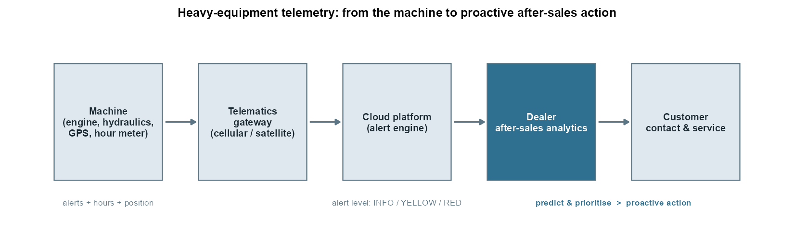

# Heavy-Equipment Failure Analysis with Telemetry Data

**From raw telemetry to a machine-learning model that prioritises critical alerts (R)**



## Context

Salinas y Fabres S.A. (SALFA) is a Chilean company that sells and services light vehicles, trucks, heavy machinery, industrial engines, parts and accessories. Within its After-Sales Management, a telemetry area centralises operational data from the machines sold to customers.

This project was developed during my role as **Business Analyst - Telematics Analytics** at SALFA. The challenge: the company received a continuous flow of telemetry data from its machines, but its actions were **reactive** (the customer calls after a failure) rather than **proactive** (the dealer contacts the customer before the failure becomes critical).

> **Data disclaimer (please read):** the original data (proprietary telemetry and sales records, including real equipment serial numbers) cannot be shared and is no longer available to me. This repository runs on a **fully synthetic dataset** generated by `scripts/00_generate_synthetic_data.R`. It reproduces the structure and the data-quality problems of the original data (same columns, missing-value patterns, outliers, skewed engine hours). For the modelling notebook, the probability of a critical alert is **deliberately tied to a few variables** (engine hours, product line, prior service, component group) plus noise. Therefore **the model metrics demonstrate the methodology; they are not performance estimates for real machines.** No real machine, customer or serial number appears anywhere.

## Business questions

- Can we use telemetry to anticipate which machines are prone to more severe failures?
- Can telemetry support after-sales management?
- Can commercial actions be targeted using the data?
- Can data-science models be built with the company's own information?

## What this repository covers

The work follows a CRISP-DM process, from data understanding to modelling:

| Notebook | Phase | What it does |
|---|---|---|
| [01 - Data Understanding](01_data_understanding.md) | Business & data understanding | Describes both sources, joins them by machine ID, builds `year_sold` and `prior_service`, drops uninformative columns |
| [02 - Data Quality](02_data_quality.md) | Data preparation | Business-rule checks, missing-value analysis, **bias check** by sales year, cleaning |
| [03 - Outlier Management](03_outlier_management.md) | Data preparation | Outlier rules (Q1 + 3xIQR per sales year; < 5 hours by business rule) and treatment |
| [04 - Descriptive Statistics](04_descriptive_statistics.md) | Exploratory analysis | Distributions, product lines, prior-service behaviour, fault frequency |
| [05 - Modeling](05_modeling.md) | **Modelling & evaluation** | Predicts critical (`RED`) alerts: logistic regression vs tuned random forest, machine-grouped cross-validation, **ROC and precision-recall curves**, gains curve, calibration, permutation importance |

## Key results (on the synthetic dataset)

**Data preparation and EDA**

- **32,594** alert records and 20 variables joined with a 4,131-machine equipment master.
- After removing machines sold outside the data window, records without a match in the equipment master (6.7%), and non-informative faults: **29,405** records. After outlier treatment: **28,616 records x 14 variables**.
- A missing-value **bias check** flagged sales-year 2012 (7% missing `tla`); the cause was non-informative `Invalid DTC Name` alerts, which were safely dropped.
- Engine hours at failure fall for newer machines (2011-2016: median about 9,000-11,000 h; 2020: below 1,000 h).
- **Backhoe loaders, motor graders and wheel loaders** concentrate ~62% of the alerts.
- **76%** of the machines with alerts had no prior service at the dealer network. **Construction machinery has the lowest share of prior service (14% vs 49% in forestry)**, the main opportunity for the commercial team.

**Machine learning: predicting critical alerts** (target: `RED` vs the rest, ~11% of alerts)

| | CV AUC (5-fold, grouped by machine) | Held-out test AUC |
|---|---|---|
| Logistic regression (selected by CV) | 0.78 | **0.77** (95% CI 0.76-0.79) |
| Random forest (tuned) | 0.73 | 0.74 (95% CI 0.72-0.76) |

- The **logistic regression beats the tuned random forest**. This is reported as is: the synthetic severity was generated from a logistic relationship, so a linear model is hard to beat here. On real telemetry, where interactions are likely, I would expect tree ensembles (and gradient boosting) to be more competitive.
- Prioritising the **top 10%** of alerts by predicted risk captures **32%** of all critical alerts (a random list captures 10%); the **top 20%** captures **54%**.
- Good practice built in: **leakage control** (`alert_defn_dsc` contains the alert level and is excluded), **split by machine** (alerts of one machine never appear in both train and test), model and threshold chosen **without the test set**, class imbalance handled with PR and gains curves, calibration checked.

## How to reproduce

Requires R (>= 4.2) and the packages `tidyverse`, `janitor`, `skimr`, `lubridate`, `naniar`, `Hmisc`, `psych`, `gmodels`, `rsample`, `ranger`, `pROC`, `yardstick`, `knitr`.

```r
# from the repository root
source("scripts/00_generate_synthetic_data.R")   # creates data/synthetic/*.csv (seeded)
source("scripts/render_notebooks.R")             # runs 01-05 and writes the .md notebooks + figures (~5 min)
```

## Repository structure

```text
.
├── 01_data_understanding.md ... 05_modeling.md   # rendered notebooks
├── scripts/                       # source of the notebooks (R, knitr::spin format)
│   ├── 00_generate_synthetic_data.R
│   ├── 01_data_understanding.R ... 05_modeling.R
│   ├── render_notebooks.R
│   └── make_telemetry_diagram.R
├── data/synthetic/                # synthetic telemetry_alerts.csv and equipment_master.csv
├── figures/                       # generated by the notebooks
└── images/
```

## Tech stack

R, tidyverse (dplyr, ggplot2), janitor, skimr, naniar, rsample, ranger (random forest), pROC, yardstick, knitr.
